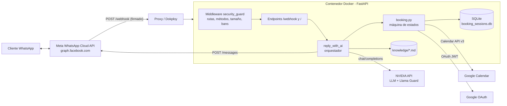
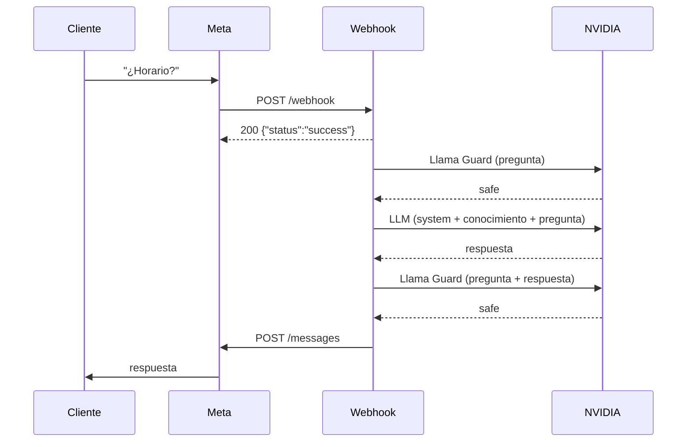
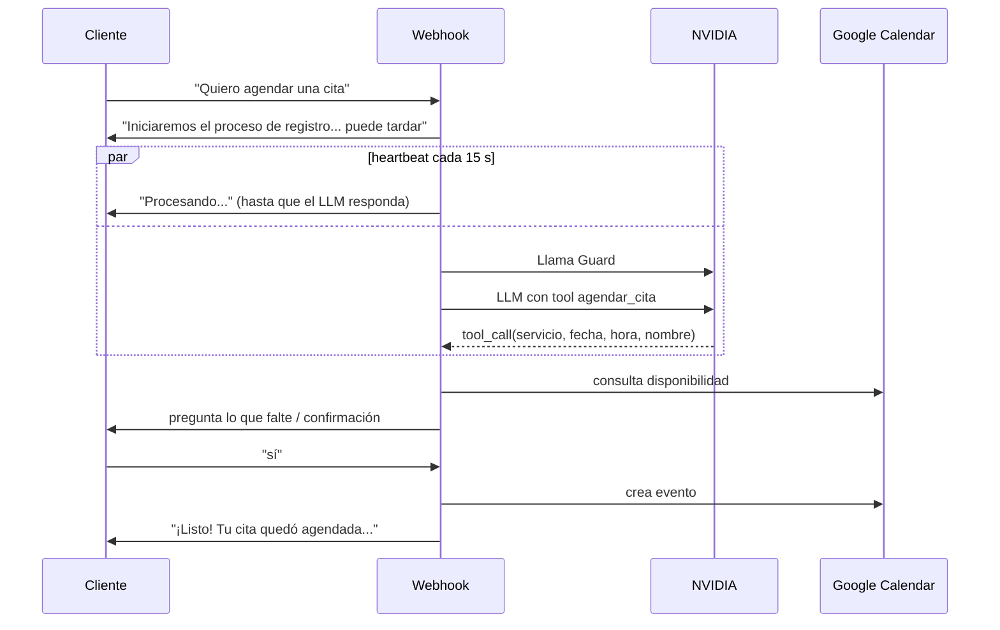
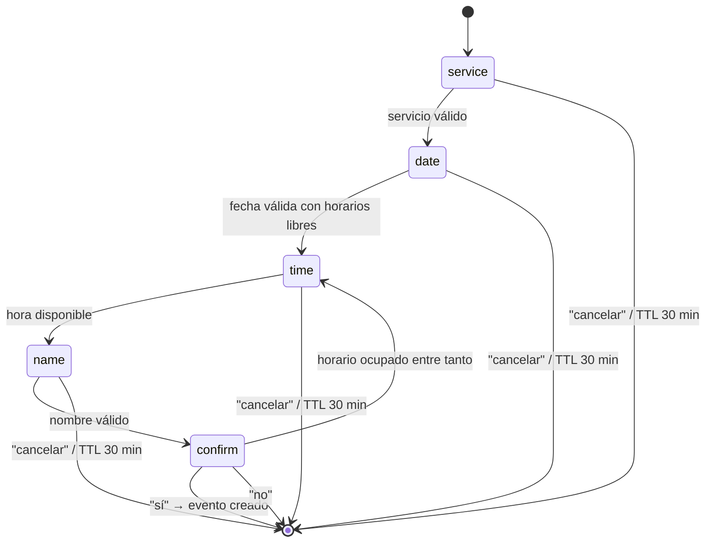
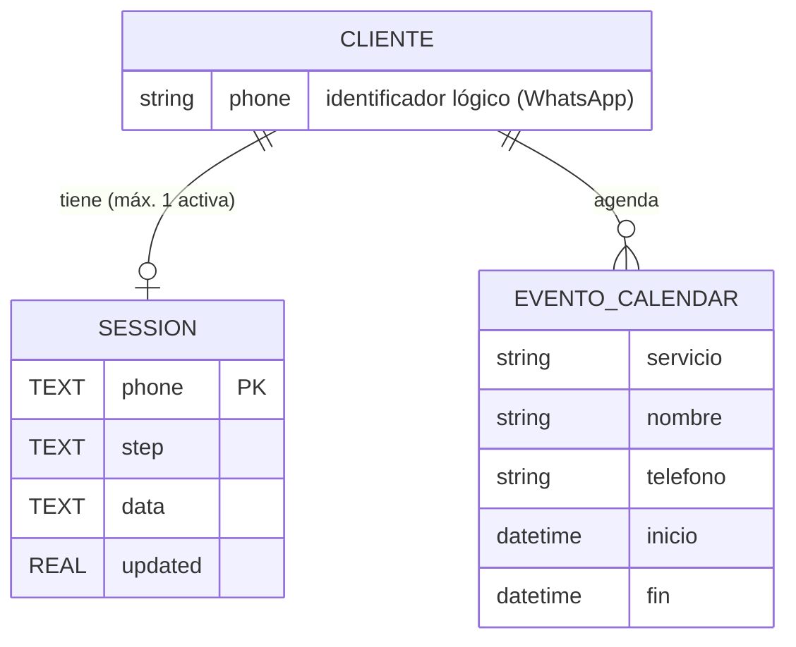

# Documentación de Diseño y Arquitectura

Sistema: **WhatsApp Meta Webhook** – asistente virtual del Taller Mecánico AutoMotor Pro.
Versión documentada: 1.0.1

## 1. Documento de Diseño de Software (SDD)

### 1.1 Propósito y alcance
Servicio web que recibe mensajes de clientes por WhatsApp Cloud API (Meta), responde preguntas del
taller con un modelo de lenguaje (LLM) basado en una base de conocimiento propia y permite agendar
citas en Google Calendar. Todo el contenido que entra y sale del LLM se modera con Llama Guard.

Fuera de alcance: panel de administración, pagos, cancelación/reprogramación automática de citas
(el cliente debe avisar al taller), mensajes que no sean texto (imágenes, audio, etc. se ignoran).

### 1.2 Requisitos principales
| ID | Requisito |
|----|-----------|
| RF-1 | Verificar el webhook con Meta (`hub.challenge`). |
| RF-2 | Recibir mensajes de texto y responder en segundo plano; Meta debe recibir `200` rápido. |
| RF-3 | Responder usando únicamente la información de `knowledge/*.md`/`*.txt`. |
| RF-4 | Moderar pregunta y respuesta con Llama Guard; bloquear contenido `UNSAFE`. |
| RF-5 | Agendar citas (servicio, fecha, hora, nombre) con confirmación explícita y validación de disponibilidad. |
| RF-6 | Al iniciar un agendado, avisar al cliente y enviar «Procesando...» cada 15 s mientras no termine el procesamiento del LLM. |
| RNF-1 | Verificar la firma `X-Hub-Signature-256` cuando `APP_SECRET` está definido. |
| RNF-2 | Bloquear IP públicas que hagan escaneos (rutas/métodos no permitidos, firmas inválidas). |
| RNF-3 | Tolerar fallos del LLM/guard: el flujo guiado de citas funciona sin LLM. |

### 1.3 Decisiones de diseño
- **FastAPI + Uvicorn** (2 workers) en un contenedor Docker, desplegado detrás de un proxy (Dokploy).
- **Respuesta en segundo plano** (`BackgroundTasks`): el POST del webhook devuelve `200` de inmediato.
- **Seguridad por defecto cerrada**: sin validar con Llama Guard no se responde, salvo
  `LLAMA_GUARD_FAIL_OPEN=true` (solo ante fallos de red/timeout).
- **Flujo de citas como máquina de estados** persistida en SQLite, compartida entre workers; las
  respuestas son fijas (sin LLM) para que las reglas del negocio sean deterministas.
- **Function calling**: el LLM solo extrae datos (`agendar_cita`); cada dato pasa por las mismas
  validaciones del flujo guiado y siempre se pide confirmación antes de crear el evento.
- **Estado de seguridad en memoria** (strikes/bans): simple, independiente por worker.

### 1.4 Estructura del código
| Archivo | Responsabilidad |
|---------|-----------------|
| `main.py` | App FastAPI, middleware de seguridad, endpoints, integración NVIDIA (LLM + guard), envío a WhatsApp, orquestación `reply_with_ai`. |
| `booking.py` | Intención de agendado, parseo de fecha/hora, máquina de estados, SQLite, cliente de Google Calendar, definición de la herramienta `agendar_cita`. |
| `knowledge/taller.md` | Base de conocimiento inyectada completa en el prompt del sistema. |
| `Dockerfile`, `requirements.txt` | Empaquetado y dependencias. |

## 2. Diagramas de arquitectura

### 2.1 Contexto y componentes


### 2.2 Secuencia: mensaje normal (pregunta informativa)


### 2.3 Secuencia: solicitud de cita


### 2.4 Máquina de estados del agendado


### 2.5 Dependencias externas
| Servicio | Uso | Credencial |
|----------|-----|-----------|
| Meta WhatsApp Cloud API | Recibir (webhook) y enviar mensajes | `WHATSAPP_TOKEN`, `VERIFY_TOKEN`, `APP_SECRET` |
| NVIDIA API (`integrate.api.nvidia.com`) | LLM conversacional y Llama Guard | `NVIDIA_API_KEY` |
| Google Calendar API v3 + OAuth2 | Disponibilidad y creación de eventos | `GOOGLE_SERVICE_ACCOUNT_JSON` |
| SQLite (archivo local) | Sesiones de agendado | `BOOKING_DB_PATH` |

Librerías Python: `fastapi`, `uvicorn`, `pydantic`, `httpx`, `google-auth`, `requests`, `tzdata`.

## 3. Modelo de datos

No hay base de datos relacional de negocio: las citas viven en Google Calendar. La única persistencia
local es SQLite para el estado de la conversación de agendado.

### 3.1 Tabla `sessions` (SQLite)
| Columna | Tipo | Descripción |
|---------|------|-------------|
| `phone` | TEXT, PK | Número del cliente (WhatsApp `from`). |
| `step` | TEXT | Paso actual: `service`, `date`, `time`, `name`, `confirm`. |
| `data` | TEXT (JSON) | Datos acumulados: `service`, `date` (ISO), `start` (ISO con zona), `name`. |
| `updated` | REAL | Timestamp de última actualización; expira a los 30 min (`SESSION_TTL_SECONDS`). |

### 3.2 Entidad evento (Google Calendar)
Atributos creados por `_create_event`: título/servicio, nombre del cliente, teléfono, inicio y fin
(`APPOINTMENT_MINUTES`, zona `CALENDAR_TIMEZONE`).

### 3.3 Diagrama entidad-relación

`CLIENTE` es una entidad lógica (no existe como tabla). `EVENTO_CALENDAR` reside en Google Calendar.

## 4. Wireframes / prototipos

El sistema no tiene interfaz gráfica propia: la interfaz es el chat de WhatsApp. Estos son los
prototipos de las conversaciones.

### 4.1 Pregunta informativa
```
┌──────────────────────────────────────┐
│ AutoMotor Pro                  ● en línea │
├──────────────────────────────────────┤
│ Cliente:  ¿Cuál es el horario?       │
│                                      │
│ Bot:      Atendemos L-V 8:00-18:00,  │
│           sáb 9:00-14:00. Domingo    │
│           cerrado.                   │
└──────────────────────────────────────┘
```

### 4.2 Agendado con avisos de progreso
```
┌──────────────────────────────────────────────┐
│ Cliente: Quiero agendar cambio de aceite     │
│          mañana a las 10, a nombre de Juan   │
│                                              │
│ Bot:     Iniciaremos el proceso de registro  │
│          de tu cita. Este proceso puede      │
│          tardar un poco, por favor espera.   │
│ Bot:     Procesando...      (cada 15 s)      │
│ Bot:     Confirma tu cita:                   │
│          • Servicio: cambio de aceite        │
│          • Fecha: miércoles 08/10/2026 10:00 │
│          • Nombre: Juan                      │
│          ¿Todo correcto? Responde «sí» o     │
│          «no».                               │
│ Cliente: sí                                  │
│ Bot:     ¡Listo! Tu cita quedó agendada...   │
└──────────────────────────────────────────────┘
```

### 4.3 Contenido bloqueado
```
│ Bot: No puedo ayudar con esa solicitud. Si necesitas información │
│      del taller, dime qué servicio buscas.                       │
```
